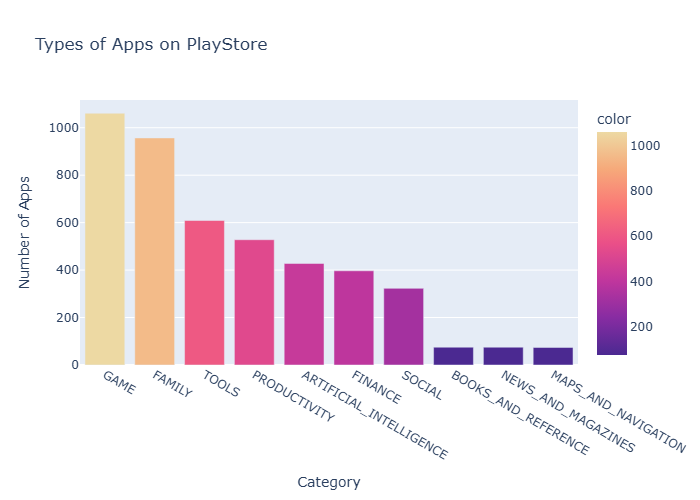

# 📊 Python Data Analysis & Visualization

Welcome to my **Python Data Analysis & Visualization** repository!

This repository contains my practice code, notes, and projects while learning data analysis using **Pandas**, **Matplotlib**, and **Plotly**. It serves as my learning journey and a reference for future projects.

---

## 🚀 Technologies Used

<p align="left">
  
  
  
  
  
</p>

---

# 📚 Topics Covered

## 🐼 Pandas

---

## 📈 Matplotlib

---

## 📊 Plotly

---

# 📂 Repository Structure

```
.
│
├── apps.ipynb
|
├── data/
│
├── notebooks/
│
├── images/
|
├── .gitignore
│
└── README.md
```

---

# 💻 Installation

Clone the repository

```bash
git clone https://github.com/Saiy5/playstore-apps-data.git
```

Move into the project

```bash
cd Pandas-Important
```

Install required libraries

```bash
pip install pandas matplotlib plotly jupyter
```

---

# ▶️ Run

Open Jupyter Notebook

```bash
jupyter notebook
```

or

```bash
jupyter lab
```

---

# 📸 Sample Visualizations

Place your screenshots inside an **images** folder.

Example:

```
images/
├── line_chart.png
├── scatter_plot.png
├── bar_chart.png
├── heatmap.png
└── dashboard.png
```

Then display them like this:

```markdown
## Bar Chart



```

---

# 🎯 Goals

- Learn Data Analysis
- Practice Python
- Master Pandas
- Learn Data Cleaning
- Build Interactive Visualizations
- Create Real-world Projects
- Improve Problem Solving
- Build Portfolio Projects

---

# 📖 Learning Resources

- Pandas Documentation
- Matplotlib Documentation
- Plotly Documentation
- Python Documentation

---

# ⭐ Future Improvements

- More real-world datasets
- Mini projects
- Dashboard projects
- Data storytelling
- Exploratory Data Analysis (EDA)
- Statistical analysis
- Machine Learning preparation

---

# 🤝 Contributions

Suggestions, improvements, and feedback are always welcome!

Feel free to fork the repository and submit a Pull Request.

---

# 📜 License

This project is licensed under the MIT License.

---

# 🌟 If you find this repository helpful

Please consider giving it a ⭐ on GitHub.

It motivates me to keep learning and sharing more projects!

---

## 👨‍💻 Author

**Suman Mondal**

Learning Python • Data Analysis • Data Visualization